# User Guide

## Getting Started
`io_mesh_tpm` is an add-on designed for Blender 3.x. You can obtain the latest version of Blender from their [download page](https://www.blender.org/download/), and of the add-on from the [releases page](https://github.com/LtSten/Blender-TPM/releases). After obtaining the zip file, this should be installed as usual - see the guide on [installing add-ons](https://docs.blender.org/manual/en/latest/editors/preferences/addons.html#installing-add-ons). Make sure to enable the add-on after installation, as shown below:

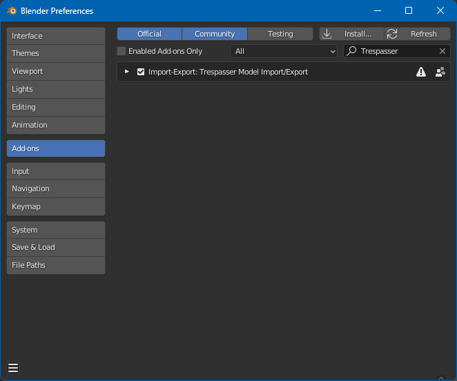

After being enabled, the add-on should provide two new menu entries:
* File > Import > Trespasser Model (.tpm)
* File > Export > Trespasser Model (.tpm)

[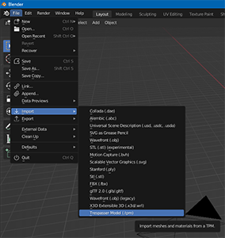](guide-file-import.png)
[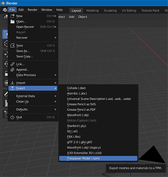](guide-file-export.png)

## Use Notes
### General Guidance
Whilst this guide attempts to provide an introduction to the add-on's functionality, a key idea to remember is that the add-on is designed such that importing and exporting should be complementary. That is, regardless of whether you are editing an imported file or authoring a scene from scratch, as long as the scene is configured in the same way as one that had been freshly imported, this should then export successfully.

Put another way, in order to learn about how content should be authored in order to work with this add-on, it suffices to examine how the import functionality configures the scene (and subsequently copy or replicate it).

For a high-level feature list, see the [readme](../README.md).

### Mesh Management
The separation between meshes and instances is respected - this means that TPM mesh blocks will be imported/exported based on the mesh name, whilst instances of that mesh are added accordingly.

To illustrate this by example, consider importing the following TPM, which contains a mesh named `PIGirder03-00` and three instances referring to that mesh: `PIGirder03-00`, `PIGirder03-01`, and `PIGirder03-02`.
```
mesh "PIGirder03-00"
{
 ...
}

instance "PIGirder03-00"
{
 mesh = "PIGirder03-00"
 position = (0.479666,-0.531638,0)
 rotation = (0.230381,11.0065,0.795775)
 scale = 0.777055
}

instance "PIGirder03-01"
{
 mesh = "PIGirder03-00"
 position = (-0.00159454,-0.0828812,0)
 rotation = (77.5759,11.0909,-77.1236)
 scale = 0.777055
}

instance "PIGirder03-02"
{
 mesh = "PIGirder03-00"
 position = (-0.478071,0.614519,0)
 rotation = (-36.4393,11.0796,21.9939)
 scale = 0.777055
}
```

This is represented in the .blend as follows:

| Instances | Instances (3D) |
| --- | --- |
| 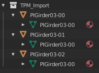 | 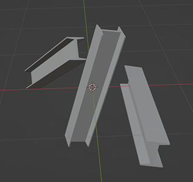 |

Note how there is one mesh data block, `PIGirder03-00`, shared between the three instances of the mesh, themselves named `PIGirder03-00`, `PIGirder03-01`, and `PIGirder03-02`. Any changes made to the mesh of one will be automatically reflected in the others.

### Material Setup
Materials should be created and assigned to faces as usual, with standard UV mapping. There are only three fields that are relevant for TPM files, each of which is optional.

| Texture Map | Shading Component | Blender BSDF Input |
| --- | --- | --- |
| colormap | Diffuse | Base Color |
| bumpmap | Normal | Normal, via a Bump node |
| opacitymap | Alpha | Alpha |

A typical material setup is shown below:

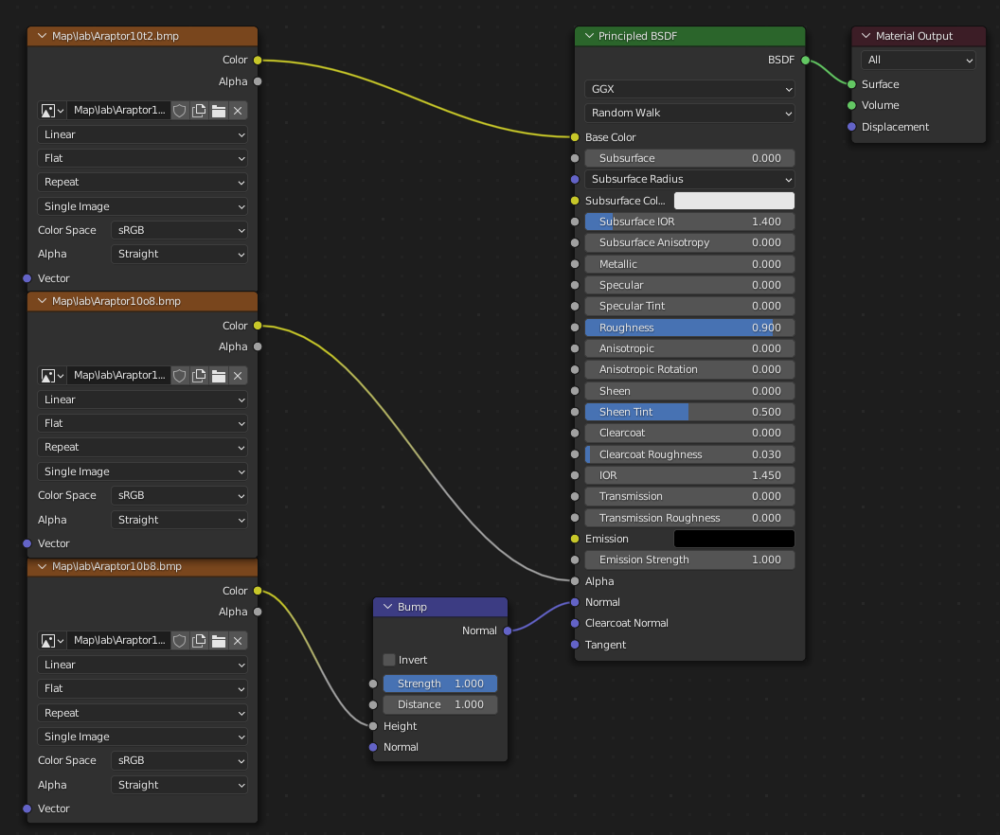

Specifically, to successfully create a material, the add-on expects the following:
* The material to be node-based ("Use Nodes" should be enabled)
* Precisely one _Material Output_ node, with a BRDF/BSDF-style `Surface` input, which in turn may have:
	* An _Image_ input into `Base Color`
	* An _Image_ input into `Alpha`
	* A _Bump_ input into `Normal`, which has a corresponding _Image_ input into its `Height`

*Note*: The directory structure of each texture input is _not_ preserved upon export. For example, a texture map of the form `Documents/Blender/Map/lab/ARaptor10t2.bmp` will be exported simply as `ARaptor10t2.bmp`.

If a material cannot be created (such as when a texture cannot be found on disk), a placeholder material will be created instead. This is the default Blender placeholder material, usually generating a pink colouration.

### Alpha Faces
For correct rendering in Blender, the Alpha material should have its Blend Mode set to Alpha Clip. This is performed by the add-on when it imports a material with an opacity map, but is not required for correct export.

Since Blender does not support duplicate faces, the `Backface Culling` toggle in an alpha material's _Settings_ is important when the "Use Material Backface Culling" export option is enabled. See [Exporting](#Exporting) for more details.

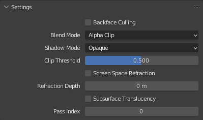

### Armatures and Bones
There are some Trespasser-specific caveats to working with armatures for TPM export in Blender. In particular, Trespasser (and hence TPM files) assigns the armature (bones) on a per-mesh (per-skin) basis, whereas Blender allows multiple instances of a model to be assigned their own armature. Furthermore, Blender associates vertices with bones via the vertex group names, allowing multiple bones (each with their own weight) per vertex: these are converted to a single bone index for TPMs.

The required setup for add-on compatible skinning is as follows:
* *All* model vertices assigned to vertex groups *ending with a two digit number*[^fn-bone-zero]. This is used to extract the `BoneIndex` parameter for each bone.
* *One* unique armature modifier assigned to each instance of the mesh, with bones corresponding to each vertex group in the mesh. It is undefined behaviour (unsupported by the add-on) to:
	* Specify multiple (active) armature modifiers on an instance
	* Specify different armature modifiers across instances of the same mesh

Upon exporting, the following behaviour occurs:
* Each vertex is assigned a unique bone by picking the bone of greatest weight
* Bones are automatically named `$J{MeshName}{BoneIndex}`, where `MeshName` is the name of the *mesh* and `BoneIndex` is the two-digit suffix of the bone

Observe that the bone names themselves are not preserved - only the (unique) two-digit number at the end of each bone's name is used. This is because each bone (joint) in Trespasser is automatically associated with the mesh based on the `$J{MeshName}{BoneIndex}` format. In particular, this means that:
* Each bone must have a non-trivial name ending in exactly a two-digit number, e.g. `$JModel04` but not `$JModel4`, `$JModel004`, or `04`
* Each bone in an armature must have a unique trailing two-digit number. For example, it is invalid to name two bones `$JHead04` and `$JFoot04` 
* It is strongly recommended (but not strictly required) that you follow the naming convention `$J{MeshName}{BoneIndex}` for bones

This is typically configured in the .blend as follows:

| Armature and Bones | Mesh, Vertex Groups, and Modifier |
| --- | --- |
| 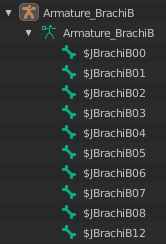 | 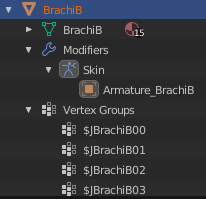 |

[^fn-bone-zero]: In keeping with Trespasser and TresEd, `00` is a valid bone index.

## Importing
The import dialog allows the selection of a single TPM file to import into Blender. There is a choice of options in the right-hand panel:

| Option | Default | Description |
| --- | --- | --- |
| Import to Active Collection | False | When enabled, any newly created models will be added into the active collection. If disabled, a new collection will be created consisting of all of the imported models. 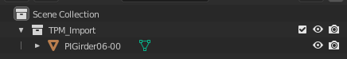 |
| Texture path override | Empty | By default, the add-on looks for textures relative to the location of the TPM being imported. When an override is specified, texture lookups will be performed using the override directory as the root instead. |
| Ignore texture directories | True | Trespasser texture names are usually of the form `Map/LevelName/TextureName.bmp`. When this option is enabled, any leading directory structure in the texture name is discarded, leaving just `TextureName.bmp`. This can be used to load textures in the same directory as the TPM (or override directory), without requiring the existence of `Map/LevelName` subfolders. |
| Overwrite existing materials | False | When enabled, any materials that already exist in the .blend file with names matching those in the TPM will be overwritten. |

A successful TPM import will perform the following actions:
* Each mesh block has a corresponding Blender Mesh data block created
* Each instance is created as a true _instance_ of the base mesh, as though performed by a "Linked Duplication". The position, rotation, and scales will be populated automatically.
* Materials will automatically be created and assigned to faces
* Each skin block - in addition to the usual mesh processing - will have its mesh vertices assigned to vertex groups named `$J{ModelName}{BoneIndex}`
* Armatures will be created for each skin and assigned to each instance of the model via an Armature modifier

## Exporting
As is standard for Blender add-ons, exporting works with the current selection, so you should select all instances that you wish to export.

Skin blocks will automatically be detected and generated based on the presence of an armature modifier. If the configuration is invalid, the add-on will attempt to export it as a mesh block instead, and provide warnings as to why the skin export failed. You can check whether a given model was exported as a skin or a mesh in the Blender console.

The export dialog has the following options:
| Option | Default | Description |
| --- | --- | --- |
| Opacity Face Export | Forward Only | As Blender does not support duplicate faces, when a face contains an alpha material (c.f. [Alpha Faces](#alpha-faces)): <ul><li>"Forward Only" exports only the forward-facing face</li><li>"Double Sided" duplicates the front face and flips the winding order</li><li>"Use Material Backface Culling" examines the "Backface Culling" material option (on a per-material basis) and writes the back face if and only if this is disabled.</li></ul> |

## Warnings, Errors, and Bug Reports
Warnings and errors will be reported as a tooltip. In general:
* Warnings mean an import has succeeded, but with some non-critical missing elements. The most common example is failing to find a bumpmap texture (note that this option is disabled by default when exporting from TresEd) - the TPM will still import/export correctly, but no bump-modulated normals will be visible in Blender.
* Errors are critical failures that mean an import has not been successful. This may be due to either an invalid TPM, or a bug in the add-on.

All output, including some additional messaging, can be viewed in the Blender console (Window > Toggle System Console).

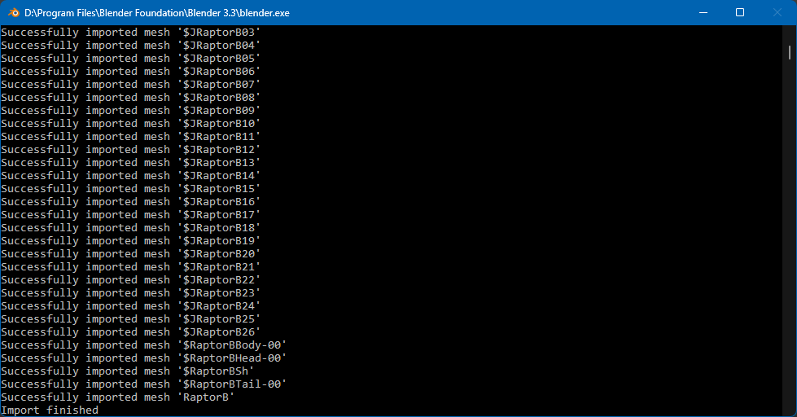

Any feedback, such as bug reports (whether with an error output or simply unexpected/incorrect behaviour), feature requests, or ideas can be reported by opening an issue on the [issues page](https://github.com/LtSten/Blender-TPM/issues).

# Links and Resources
* [Installing add-ons](https://docs.blender.org/manual/en/latest/editors/preferences/addons.html#installing-add-ons)
* [Add-on TresCom forum thread](https://www.trescomforum.org/viewtopic.php?f=58&t=11689)