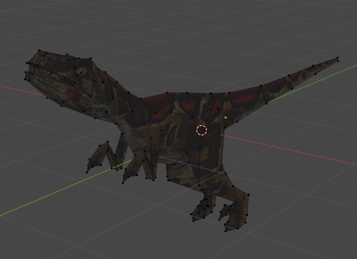

# io_mesh_tpm
This project is a Blender add-on, `io_mesh_tpm`, designed to support the import and export of [TPM files](https://www.trescom.org/files/docs/formats.html#TPM), a [community](https://www.trescom.org/)-created model format for the game [Trespasser](https://en.wikipedia.org/wiki/Trespasser_(video_game)) similar to [obj](https://en.wikipedia.org/wiki/Wavefront_.obj_file).

## Installation and Use
This addon is intended for use with Blender 4.x - the most recently verified supported version is 4.0.0. Installation should proceed as usual for Blender addons - download the desired version of `io_mesh_tpm.zip` and follow the steps in the Blender guide for [installing add-ons](https://docs.blender.org/manual/en/latest/editors/preferences/addons.html#installing-add-ons).

For usage instructions, please see the [user guide](Documentation/UserGuide.md).

Note that add-on versions apply to Blender as follows:
* Addon versions 1.x.y are compatible with Blender 4.z
* Addon versions 0.x.y are compatible with Blender 3.z. The last such add-on version was [0.5.2](https://github.com/LtSten/Blender-TPM/releases/tag/v0.5.2), and was tested against Blender 3.6.1.

## Project Status
### Features
* Support for TresEd-generated TPM files
* Import/export of meshes and instances from TPMs with corresponding positions, scales, and rotations
* Import/export of bones and skin via armature generation
* Import/export of materials with references generated to on-disk textures
* Automatic texture node creation and hook-up upon import

### Roadmap/Known Issues
* TScript attributes are unsupported and are not preserved in an import/export process
* Extended/"meta" TScript attributes (such as `ext_GeometryType`) are not supported

## Feedback and Support
If you wish to provide feedback, suggestions, or report a bug, please use one of the following methods:
* Open an issue on [GitHub](https://github.com/LtSten/Blender-TPM/issues)
* If you are a TresCom forum member, by replying to the corresponding [TPM add-on post](https://www.trescomforum.org/viewtopic.php?f=58&t=11689)
* If you are a member of the TresCom Discord server[^tc-discord], by posting a message in the [#modding channel](https://discord.com/channels/424991183547400193/505799931412611082) mentioning `@LtSten`, or reach out to me directly

[^tc-discord]: If you are not a member but wish to join, use the "TresCom Discord" link on the [TresCom homepage](https://www.trescom.org/)